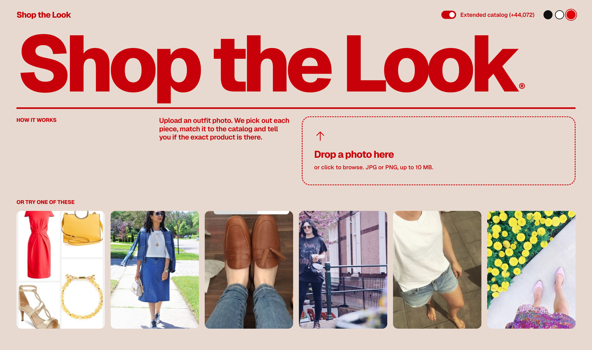
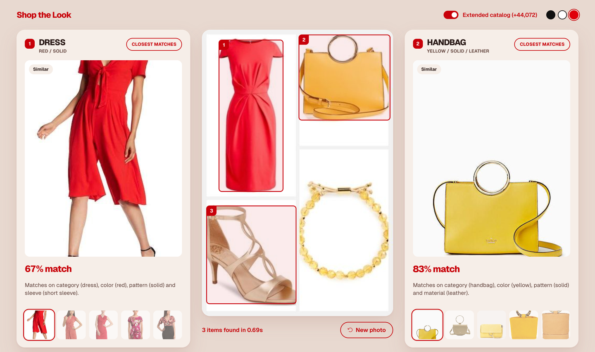

# Shop the Look

Upload an outfit photo: the app detects each garment or accessory, matches it to a product catalog, says whether the exact product exists, and explains every recommendation. Pretrained models only (OWLv2 detector, Marqo-FashionSigLIP embeddings); no training.

**Live app (real uploads): https://uplsiddharth-byte.github.io/Shop-the-Look-Visual-Product-Discovery/live.html** runs on the author's Mac through a free tunnel and restarts by itself at login, so it is available only while that Mac is on and awake; otherwise the link shows an "offline" page. A **[static preview](https://uplsiddharth-byte.github.io/Shop-the-Look-Visual-Product-Discovery/)** (recorded results for six sample photos) is always available. To run it yourself see "Run the demo" below and [DEPLOY.md](DEPLOY.md). Full write-up: [technical document (PDF)](docs/Shop_the_Look_Technical_Document.pdf).

| Upload screen | Results |
|---|---|
|  |  |

## Results (288 validation pairs; true product within the top K shown for any detected item)
| Catalog searched | R@1 | R@5 | R@10 | R@100 |
|---|---|---|---|---|
| Provided catalog (28,094 products) | 4.9% | 10.4% | 15.3% | 28.8% |
| + optional extended catalog (72,166 products, default in the UI) | 4.9% | 9.4% | 13.9% | 26.7% |
| Random | | 0.02% | 0.04% | 0.36% |

Validation labels are loose (the paired product often only resembles the item in the scene), so these understate usefulness. Automated checks: 68 test images and 12 hostile-upload cases all pass, also from a clean CPU-only install (about 1.4 s per photo). Details and limitations are in the technical document.

## Run the demo from a fresh clone
This repository holds code only. The search index and product images (`data/`) and the company's `dataset/` files are **not in git**, so a bare clone cannot start (the server exits with `Missing data in .../data`). Download the data bundle from Google Drive: [core, required (708 MiB)](https://drive.google.com/file/d/1ZURkBRv8Co3X5mW842BTus9X0ry4YfuT/view?usp=sharing) and [extended, optional (2.4 GiB)](https://drive.google.com/file/d/1a4SmDz1raLfyVQd8gOiHndmhdDTHDoc3/view?usp=sharing). Put the `.tar` files in the repo root, then:
```bash
uv venv --python 3.12 .venv && uv pip install --python .venv/bin/python -r requirements.txt
tar -xf shop-the-look-data-core.tar        # creates data/ : provided catalog, index, sample scenes (about 0.7 GB)
tar -xf shop-the-look-data-extended.tar    # optional: +44,072 extended products (about 2.4 GB)
./run.sh                                   # open http://localhost:8000 (HOST, PORT, DEVICE=cpu|cuda|mps optional)
curl localhost:8000/api/health             # model load takes 30 to 60 s
```
The first start downloads the two models (about 2 GB) from Hugging Face, so it needs internet once. `dataset/` is only needed to rebuild the index and run the evaluation scripts, not to run the app. Without the bundle, use the live link above or rebuild everything ("Rebuild from scratch", which needs `dataset/`).
Deploying elsewhere: see `DEPLOY.md` (what to ship, memory, security notes, Docker).

## Rebuild from scratch
```bash
uv venv --python 3.12 .venv && uv pip install --python .venv/bin/python -r requirements.txt
.venv/bin/python app/fetch.py              # catalog + validation scene images (554 s, 64 threads)
cd app
../.venv/bin/python embed.py siglip        # catalog embeddings (4 views for the ablation; ~36 min on M-series, ~9 min for 'full' only)
../.venv/bin/python detect_all.py          # detections for the 321 validation scenes
../.venv/bin/python final_eval.py          # headline metrics + exact-match threshold -> data/metrics.json, data/config.json
../.venv/bin/python evaluate.py siglip     # ablation: whole-scene vs crops, single vs multi-view
```

## Extended catalog (optional, +44,072 products)
```bash
# 5 parquet shards of benitomartin/fashion-product-images-small-384x512 -> data/extended/shard{0..4}.parquet (parallel curl, ~5 min)
cd app && ../.venv/bin/python ext_extract.py && ../.venv/bin/python ext_embed.py && ../.venv/bin/python build_blocklist.py
EXT=1 ../.venv/bin/python final_eval.py   # metrics with the extended index -> data/metrics_ext.json
```
The UI switch "Extended catalog" (or `?extended=false` on `/api/search`) turns it off.

## Tests (start the server first; set `API=localhost:8001` to target another server)
```bash
.venv/bin/python tests/check.py            # 68 images, expected result per group, exit 1 on any failure
.venv/bin/python tests/edge_cases.py       # 12 hostile/unusual uploads and their required HTTP status
.venv/bin/python tests/explain_dets.py tests/img/x.jpg   # why each detector box was kept or dropped
```

## Layout
```
app/        backend: detection, embedding, ranking, explanations, FastAPI server, evaluation + tuning scripts
web/        the UI (plain HTML/CSS/JS, no build step; Geist font and Phosphor icons vendored in web/vendor)
tests/      check.py (image suite), edge_cases.py (hostile uploads), explain_dets.py, make_test_images.py
docs/       technical document (HTML source + PDF)
data/       NOT in git: images, embeddings, caches (rebuild with the steps above, or see DEPLOY.md)
dataset/    NOT in git: the catalog and validation .jsonl files provided with the assignment
```
Key files: `app/pipeline.py` (detect, relabel, verify, declutter), `app/explain.py` (tags, families, explanations), `app/server.py` (API), `data/config.json` (tuned weights), `DEPLOY.md` (deployment), `app/build_demo_site.py` (builds the static demo).

## Third-party material
Models: OWLv2 (`google/owlv2-base-patch16-ensemble`) and Marqo-FashionSigLIP, downloaded from Hugging Face at first start. Fonts and icons in `web/vendor`: Geist (SIL OFL) and Phosphor Icons (MIT). The optional extended catalog is the public Fashion Product Images dataset (Hugging Face mirror `benitomartin/fashion-product-images-small-384x512`; license not stated on the mirror). Catalog and validation data come from the assignment and are not redistributed here.
